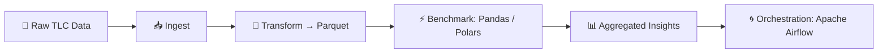

# billion-air-flow


[](https://www.linkedin.com/in/iainjclark/)


🚕 **Scalable end-to-end ETL pipeline** for NYC Taxi & Limousine Commission (TLC) Trip Record Data — 1B+ rows of rides since 2009.

A full end-to-end data engineering project: ingesting, transforming, and benchmarking 1B+ NYC Taxi & Limousine Commission (TLC) trip records (2009–present), using Apache Airflow for orchestration and ~~Pandas~~/Polars for more scalable analytics. 👋🚖 Taxi!


<div align="center">
⚠️ 🚧 <strong>TRAFFIC ADVISORY:</strong> <B>Congestion on Pandas Avenue ahead. Consider taking Polars Freeway</b> 🚧 ⚠️
</div>



## You Jump Into The Taxi

"Hey boss, where do you wanna go?" asks the taxi driver, taking a swig of his caw-fee.

And that is the question. There is a whole ton of data there! But first, you have to marshal it and get it all into one place.
Without that, you are not going to be able to get any insights. And, as I like to say, with great data comes great responsibility.

This repo shows you how to do that - in a performant, responsible way.

Like a New York fairytale — the lights, the buzz, not much sleep — the cabbie pulls away from the kerb. For him - and us - it's time to get to work.

## 🛠️ Technical Project Introduction

The dataset available to us is the [NYC TLC dataset](https://www.nyc.gov/site/tlc/about/tlc-trip-record-data.page) and it is 
extensive. It contains trip records dating back to 2009, with **billions of individual taxi rides** across multiple services (yellow cabs, green cabs, and for-hire vehicles).  
Each monthly CSV file is hundreds of MBs, and the entire corpus is measured in **terabytes** if uncompressed.

This creates both an opportunity and a challenge:

- **Opportunity**: The dataset captures the pulse of New York City — trips, fares, tips, time-of-day patterns, and borough-level dynamics over more than a decade.  
- **Challenge**: Working at this scale requires data engineering techniques that go beyond local CSV processing. Efficient ingestion, storage, and analytics are essential.

The driver makes a right onto Mechanics Alley on the Lower East Side, and we pull up at the job site. Showtime.

## Engineering Overview
I demonstrate data engineering techniques which scale to 1B+ rows:
- **Ingest** raw monthly TLC trip data from the [NYC TLC dataset](https://www.nyc.gov/site/tlc/about/tlc-trip-record-data.page)
- **Transform** into partitioned Parquet files (clean timestamps, fares, locations).
- **Benchmark** Pandas vs Polars (and Dask?) on datasets from 10M → 1B rows.
- **Output** aggregated insights (avg fare per borough, trips per hour).
- **Orchestrate** with Apache Airflow (work in progress).

Developed on Python 3.10 for compatibility with Ubuntu 22.04 LTS and stability with Apache Airflow 2.8+ and modern data libraries (Polars - Dask? PyArrow?). Testing against Ubuntu 24.04 LTS / Python 3.12 is planned.

```bash
mamba install pandas polars dask pyarrow matplotlib seaborn
pip install apache-airflow==2.8.*
```
- N.B. Airflow is pip-only, not conda-forge 


## Repo Structure
- `airflow/` – DAGs for orchestration.
- `notebooks/` – Exploration & benchmarks.
- `scripts/` – ETL transformations.
- `requirements-dev.txt` – Pip environment.
- `environment-dev.yml` – Conda/Mamba environment.


## Next Steps
1. Proof-of-concept ETL on sample months (10M rows).
2. Add benchmarks & plots.
3. Scale to 1B+ rows on workstation & cloud.

---

> ⚡️ Current status: Barebones repo scaffolding.  
> Full ETL workflows and benchmarks coming soon.
