# billion-air-flow


[](https://www.linkedin.com/in/iainjclark/)


🚕 **Scalable end-to-end ETL pipeline** for NYC Taxi & Limousine Commission (TLC) Trip Record Data — 1B+ rows of rides since 2009.

A full end-to-end data engineering project: ingesting, transforming, and benchmarking 1B+ NYC Taxi & Limousine Commission (TLC) trip records (2009–present), using Apache Airflow for orchestration and ~~Pandas~~/Polars for more scalable analytics. 👋🚖 Taxi!

```mermaid
%%{init: { "theme": "default", "themeVariables": {}, "flowchart": { "htmlLabels": true }, "securityLevel": "strict" , "themeCSS": ".mermaid .controls{display:none;}"} }%%
flowchart LR
    A[🚕 Raw TLC Data] --> B[📥 Ingest]
    B --> C[🧹 Transform → Parquet]
    C --> D[⚡ Benchmark: Pandas / Polars]
    D --> E[📊 Aggregated Insights]
    E --> F[🌀 Orchestration: Apache Airflow]
```


<br/>

<p align="center">⚠️ 🚧 <B>TRAFFIC ADVISORY: Congestion on Pandas Avenue ahead. Consider taking Polars Freeway</b> 🚧 ⚠️</p>



## Project Narrative
This repo demonstrates data engineering that scales to 1B+ rows:
- **Ingest** raw monthly TLC trip data from the [NYC TLC dataset](https://www.nyc.gov/site/tlc/about/tlc-trip-record-data.page)
- **Transform** into partitioned Parquet files (clean timestamps, fares, locations).
- **Benchmark** Pandas vs Polars (and Dask?) on datasets from 10M → 1B rows.
- **Output** aggregated insights (avg fare per borough, trips per hour).
- **Orchestrate** with Apache Airflow (work in progress).

Developed on Python 3.10 for compatibility with Ubuntu 22.04 LTS and stability with Apache Airflow 2.8+ and modern data libraries (Polars - Dask? PyArrow?). Testing against Ubuntu 24.04 LTS / Python 3.12 is planned.

```bash
mamba install pandas polars dask pyarrow matplotlib seaborn
pip install apache-airflow==2.8.*
```
- N.B. Airflow is pip-only, not conda-forge 


## Repo Structure
- `airflow/` – DAGs for orchestration.
- `notebooks/` – Exploration & benchmarks.
- `scripts/` – ETL transformations.
- `requirements-dev.txt` – Pip environment.
- `environment-dev.yml` – Conda/Mamba environment.


## Next Steps
1. Proof-of-concept ETL on sample months (10M rows).
2. Add benchmarks & plots.
3. Scale to 1B+ rows on workstation & cloud.

---

> ⚡️ Current status: Barebones repo scaffolding.  
> Full ETL workflows and benchmarks coming soon.
