# billion-air-flow


[](https://www.linkedin.com/in/iainjclark/)


🚕 **Scalable end-to-end ETL pipeline** for NYC Taxi & Limousine Commission (TLC) Trip Record Data — 1B+ rows of rides since 2009.

A full end-to-end data engineering project: ingesting, transforming, and benchmarking 1B+ NYC Taxi & Limousine Commission (TLC) trip records (2009–present), using Apache Airflow for orchestration and ~~Pandas~~/Polars for more scalable analytics. 👋🚖 Taxi!

```mermaid
%%{init: { "theme": "default", "themeVariables": {}, "flowchart": { "htmlLabels": true }, "securityLevel": "strict" , "themeCSS": ".mermaid .controls{display:none;}"} }%%
flowchart LR
    A[🚕 Raw TLC Data] --> B[📥 Ingest]
    B --> C[🧹 Transform → Parquet]
    C --> D[⚡ Benchmark: Pandas / Polars]
    D --> E[📊 Aggregated Insights]
    E --> F[🌀 Orchestration: Apache Airflow]
```


<div align="center">
⚠️ 🚧 <strong>TRAFFIC ADVISORY:</strong> <B>Congestion on Pandas Avenue ahead. Consider taking Polars Freeway</b> 🚧 ⚠️
</div>



## You Jump Into The Taxi

"Hey boss, where do you wanna go?" asks the taxi driver, taking a swig of his caw-fee.

And that is the question. There is a whole ton of data there! But first, you have to marshal it and get it all into one place.
Without that, you are not going to be able to get any insights. And, as I like to say, with great data comes great responsibility.

This repo shows you how to do that - in a performant, responsible way.

Like a New York fairytale — the lights, the buzz, not much sleep — the cabbie pulls away from the kerb. For him - and us - it's time to get to work.

## 🛠️ Technical Project Introduction

The dataset available to us is the [NYC TLC dataset](https://www.nyc.gov/site/tlc/about/tlc-trip-record-data.page) and it is 
extensive. It contains trip records dating back to 2009, with **billions of individual taxi rides** across multiple services (yellow cabs, green cabs, and for-hire vehicles).  
Each monthly CSV file is hundreds of MBs, and the entire corpus is measured in **terabytes** if uncompressed.

This creates both an opportunity and a challenge:

- The dataset captures the pulse of New York City — trips, fares, tips, time-of-day patterns, and borough-level dynamics over more than a decade.  
- Working at this scale requires data engineering techniques that go beyond local CSV processing. Efficient ingestion, storage, and analytics are essential.

The driver makes a right onto Mechanics Alley on the Lower East Side, and we pull up at the job site. Showtime.

## Engineering Overview
I demonstrate data engineering techniques which scale to 1B+ rows:
- **Ingest** raw monthly TLC trip data from the [NYC TLC dataset](https://www.nyc.gov/site/tlc/about/tlc-trip-record-data.page)
- **Transform** into partitioned Parquet files (clean timestamps, fares, locations).
- **Benchmark** Pandas vs Polars (and Dask?) on datasets from 10M → 1B rows.
- **Output** aggregated insights (avg fare per borough, trips per hour).
- **Orchestrate** with Apache Airflow (work in progress).

Developed on Python 3.10 for compatibility with Ubuntu 22.04 LTS and stability with Apache Airflow 2.8+ and modern data libraries (Polars - Dask? PyArrow?). Testing against Ubuntu 24.04 LTS / Python 3.12 is planned.

## 🛠️ Hardware

Dell Precision 3431 SFF — Intel i7-8700 (6c/12t), 16 GB DDR4-2666, Intel 660p NVMe SSD (1 TB, PCIe 3.0 ×4, QLC NAND), Seagate IronWolf 6 TB SATA HDD, Quadro P400. Which we will upgrade to 32GB RAM and then 64GB RAM.

This rig was chosen for being super-compact, quiet, lightweight (5.5 kg), and exceptionally inexpensive (A$250 for the base system: 16 GB RAM, no SATA HDD; the 6TB drive was added after delivery). While not the kind of machine one normally expects to be crunching billion-row datasets, this project demonstrates what is possible with near-legacy hardware, a tight budget, a little ingenuity — and an OLAP database management system 🦆.

## 💾 OS and Storage

Configured as a **triple-boot** rig with lean partitioning: Windows 10 Pro (128 GB) / Ubuntu 22.04 LTS (64 GB) / Ubuntu 24.04 LTS (64 GB), leaving ~680 GB on the NVMe as a **shared hot staging tier**.  
- **Tier 1 (NVMe SSD, 1 TB)** — Hot staging tier; for active analytics and Parquet datasets.  
- **Tier 2 (HDD, 6 TB IronWolf 7200 RPM)** — Cold storage of CSV datasets.  
- **Tier 3 (AWS S3)** — Active cloud analytics.
- **Tier 4 (USB 3.2 Gen 2x2; optional)** — Warm storage: buffer/pre-staging/cache layer for transfer between HDD and NVMe. Candidates are Lexar SL500, Samsung T9 or Crucial X10 Pro.

Because the Intel 660p is a QLC drive, bulk writes are expected to be considerably slower once the SLC cache is exhausted. The Tier 1 disk will therefore be upgraded to a Samsung 990 PRO (TLC NAND, PCIe 4.0), retaining the same partitioning.

The final upgrade planned is to swap out the i7-8700 for the 9th gen i7-9700.

## Software

mamba-forge was installed from [MiniForge](https://github.com/conda-forge/miniforge/releases/download/25.3.0-3/Miniforge3-25.3.0-3-Linux-x86_64.sh) and used to set up
jupyter in its own dedicated kernel, and Python 3.10 with the libraries required in its own virtual environment py3a-baf. 

```bash
wget https://github.com/conda-forge/miniforge/releases/download/25.3.0-3/Miniforge3-25.3.0-3-Linux-x86_64.sh
chmod +x Miniforge3-25.3.0-3-Linux-x86_64.sh
bash Miniforge3-25.3.0-3-Linux-x86_64.sh
source ~/miniforge3/bin/activate
mamba shell init --shell bash --root-prefix=~/miniforge3
mamba create -n jupyterenv python jupyterlab ipykernel
git clone https://github.com/iainjclark/billion-air-flow.git
cd $YOUR_GITS/billion-air-flow
mamba create -n py3a-baf python=3.10
mamba activate py3a-baf
mamba env update -f environment-dev.yml --prune
```

## 📥 Ingesting the Data

To start, I used a PowerShell script in Windows 10 to download all Parquet files onto Tier 1 storage, before moving the corpus to local warm storage on the Tier 2 drive.

Note that additional data and extra context can be found at [NYC Open Data](https://opendata.cityofnewyork.us/).

Data ingestion and initial staging were carried out on the stock SSD — no reason to wait!

In PowerShell:
```powershell
Set-ExecutionPolicy RemoteSigned -Scope CurrentUser
.\scripts\download_tlc.ps1
```

## 📦 Installing the Libraries

```bash
mamba install pandas polars dask pyarrow matplotlib seaborn
pip install apache-airflow==2.8.*
```
- N.B. Airflow is pip-only, not conda-forge 


## Repo Structure
- `airflow/` – DAGs for orchestration.
- `notebooks/` – Exploration & benchmarks.
- `scripts/` – ETL transformations.
- `requirements-dev.txt` – Pip environment.
- `environment-dev.yml` – Conda/Mamba environment.

## Next Steps
1. Proof-of-concept ETL on sample months (10M rows).
2. Add benchmarks & plots.
3. Scale to 1B+ rows on workstation & cloud.

---

> ⚡️ Current status: Barebones repo scaffolding.  
> Full ETL workflows and benchmarks coming soon.
